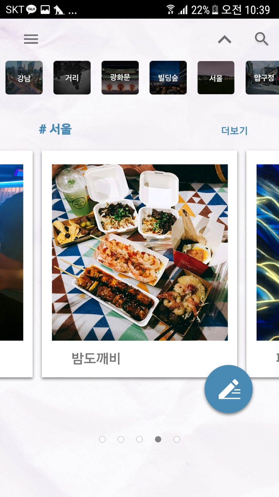
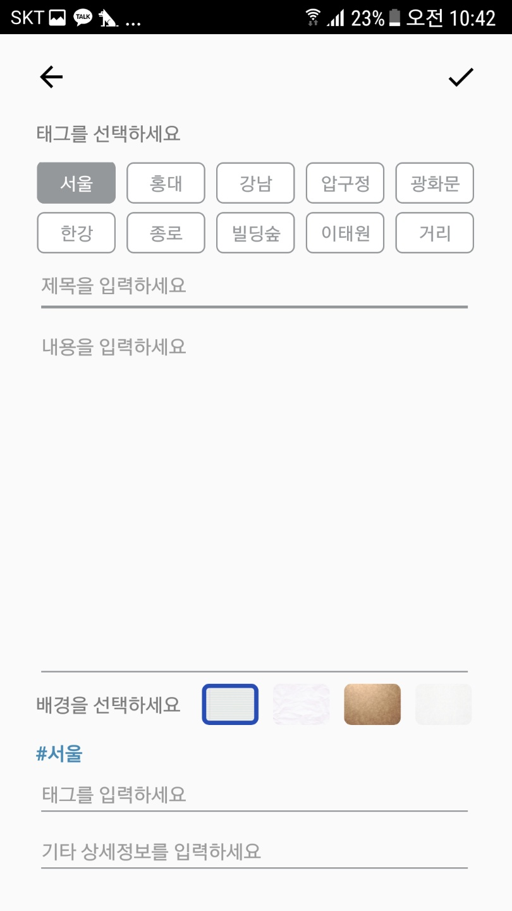
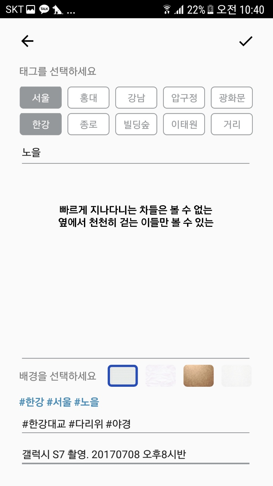
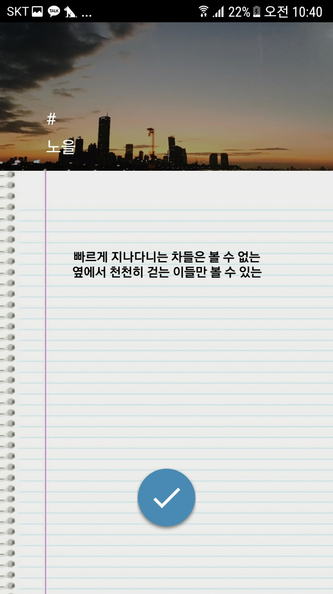
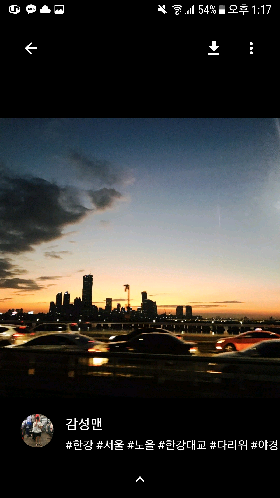
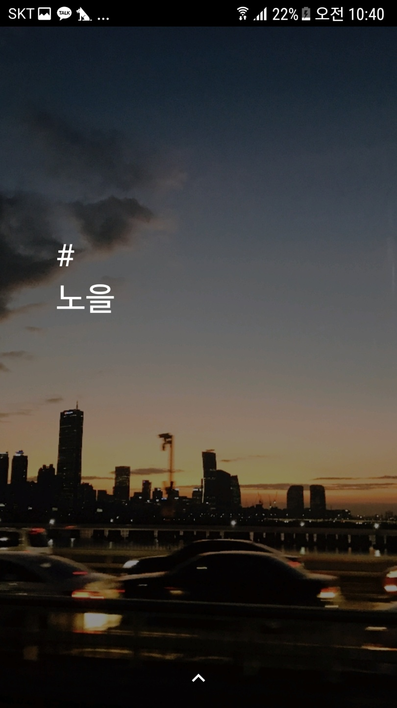
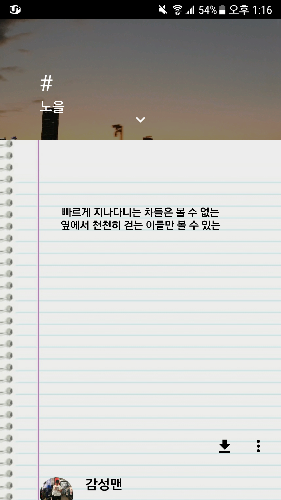
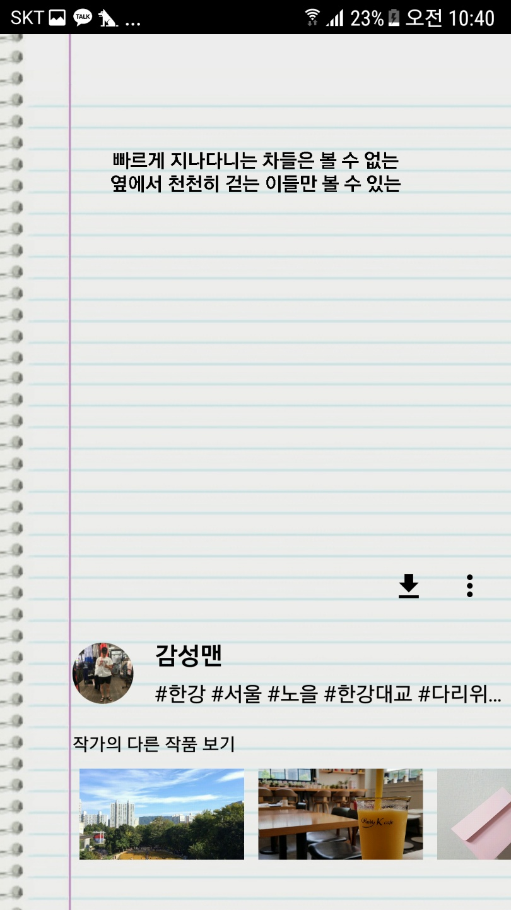

# 서울,시

### 서울시앱공모전 예선

서울의 사진과 작성한 시를 앱에 담을 수 있고, 다른 사람의 시와사진을 열람할 수 있는 서비스. 

서울시 앱공모전 : [SeoulMobilePlatform](https://mplatform.seoul.go.kr/w/contest/award/2017/nominee/selectNominee.do)

### 개발자
- 팀명 : 킹스울맨
- 기획 : 박종훈
- 디자이너 : 구희정
- 서버 개발자 : 송진욱, 최사랑
- 안드로이드 개발자 : 고준희, 김민정, 김혜린

### 개발환경
- 플랫폼(개발버전) : 안드로이드(Nugat 7.0)
- 서버언어 : nodeJS
- DB : MYSQL(AWS RDS), amazon webservice S3
- 활용DB : 문화 행사카테고리 '시의 도시 서울' 소식(서울특별시 보유)
- 사용협업 플랫폼/툴 : GitHub, Trello, Postman, Zeplin

### PREVIEW

메인 페이지

글쓰기 페이지

  

사진 페이지

 

시 페이지

 
